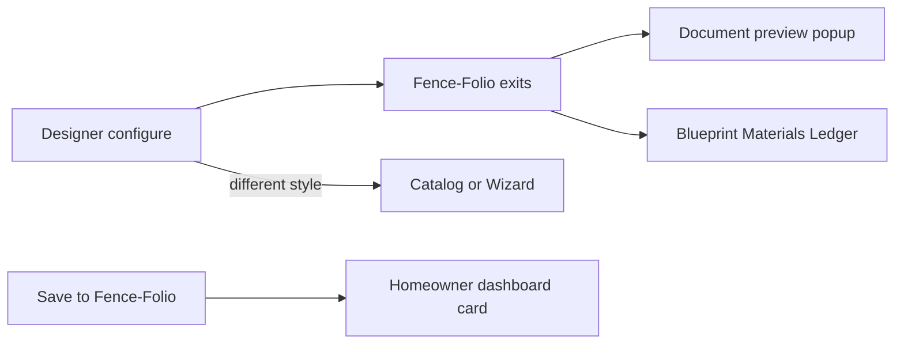
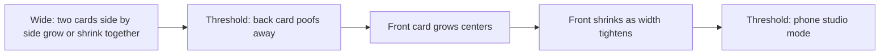

# Heritage Designer — Green Print Accordion Plan

## Verdict: easiest modernization path

**Chosen path: hybrid shell + Heritage guts.**

| Approach | Effort | Fit |
| --- | --- | --- |
| Port dark Heritage HTML wholesale | Very high | Fights cream/grid goal |
| Ship StudioConfigurator as-is | Low | Wrong canvas; mixes Folio into designer |
| **Green Print shell + accordion rail + heritage-v1 assets** | Medium | Matches style goal + real configure data |

Park the cream mock as a **layout sketch only**. Keep its **scrolling left accordion + explode options**. Scrap photo placeholders, in-designer Folio chapters, and dark full-page chrome.

Styling source of truth: Green Print (`#F4ECDC` + 100px/25px grid, Rowdies, 5px / 2.5px ink, wood/green `SurfacePlate`).

## Product decisions (locked)

### Pricing — simplify (isolated, expect churn)

- **No** heavy BOM / takeoff calculator inside `/designer`.
- **Base linear feet = 8** (one panel in viewBox). LF control in left menu.
- Use the **original pricing equation** from the current Heritage / site pricing path (port into an isolated module). **Do not** stamp “TRIAL” in the UI — but keep the module easy to swap; pricing will change many times.
- Running total is **display-only** in the strip.
- Full material takeoff / ledger math stays under **Fence-Folio**.

### Templates — no; defaults = Heritage vertical picket / cedar

- **No** in-designer template picker.
- Different fence → Catalog / Wizard link.
- Boot: vertical picket + cedar picket ≡ Heritage; controls scoped to active type/style.
- **Every fence style has a complete default option set pre-selected** (blank-default registry values for that style — height, panel, LF=8, posts, rails, pickets, trim, finish, gates, etc.). Opening a style never lands with empty/unset chapters; Reset restores **that style’s default option set**, not a global empty state.

### Session persistence + reset + account handoff

- Edits persist for the **active browser session** (session memory) keyed by style.
- **Reset** restores blank Heritage default for active style.
- **Account system** (existing log-in): session holds the working fence. If user **Save to Folio** or **opens Folio docs** while logged out → **sign-up / sign-in prompted**, and the **working fence draft is preserved through signup** then attached after auth (handoff payload / pending draft in session).
- Members: Save → Folio card on homeowner dashboard; can view Folio docs.

### Blueprint / Materials / Ledger — Fence-Folio (membership)

- Folio exits from designer; guests see a **blurred doc teaser** with **log-in / sign-up focus** (not a hard empty block).
- Members get full preview / pages.

## Target layouts (designer only)

Elevation stage is a **single container that houses two cards** (front + back) with **pre-configured aspect ratios**. Cards **grow/shrink together** as the viewport changes — continuous dynamic scaling, not only hard CSS breakpoints.

### Elevation continuum (locked from R2)

1. **Wide:** container holds **two cards**; both scale dynamically with shared ratio.
2. **Mid threshold:** back card **disappears (poof)**; front **grows and centers**.
3. **Narrower:** front **shrinks** with the container.
4. **Phone threshold:** **poof** into phone studio (two-row: elevation + flip on top, control console below).

Control chrome still adapts (left accordion when space; thin chapter bar when needed; phone bottom console). **#4 accordion vs thin bar** remains a visual Keep/Park call; dual-card continuum is the elevation rule.

### Dynamic controls stacking

- Thin chapter bar when left accordion crowds the elevation container (provisional).
- Phone: nav stays; footer gone; lower half = control console; title/info → dropdown/thin bar.

### Footer (R4)

- **Show SiteFooter only if the studio fits without forcing page scroll.** If footer would force scroll, **omit it** (phone always omits; desktop/tablet conditional).

### Controls placement / chapters

Unchanged: all configure controls in left scrolling menu (incl. LF default 8); strip = readout + Reset + Folio/Catalog only. Panel length (bay) + LF independent — panel = SVG bay, LF = pricing run.

## Asset source of truth

`D:\Lew-Line-Workspaces\Design\FenceBook\public\configure\heritage-v1`

- `components/` SVGs; `pilot-fences/vpf/heritage/` assemblies + preview JS
- Copy needed SVGs/JSON into Public-Website `public/configure/heritage-v1/...` for runtime
- Use registry **defaults** for blank style start — do not expose template marketing matrix in UI

## Implementation phases

### Phase A — Green Print primitives

`TechnicalGridBackground`, `PageContainer`, `SurfacePlate`, minimal `Button`; `ff.*` tokens in `app/globals.css`.

### Phase B — Desktop shell (dual elevation)

Rewrite `app/designer/page.tsx`: dual front+back stage at `lg+`, accordion and/or thin top bar, total strip (Reset + Folio exits), shared config context.

### Phase B2 — Tablet breakpoint (one-up + thin top bar)

First-class tablet layout: single elevation + flip; thin option-set bar above stage; no dual until desktop; no complex box relocate.

### Phase B3 — Phone breakpoint

Two-row studio; no stacked desktop rail.

### Phase C — Config state + pricing

- Session memory for active fence; Reset; pending-draft handoff through signup.
- All configure controls in left menu model (incl. LF).
- Isolated pricing module using **original equation** (easy to replace; expect churn; no “TRIAL” badge in UI).

### Phase D — Fence-Folio exits

- Blurred doc teaser + log-in focus for guests.
- Members: full preview / Save → dashboard card.
- Preserve working fence across signup.

### Phase E — Later

- Real account-backed Folio persistence
- Deeper stack-composer parametric SVG
- Multi-style beyond Heritage VPF
- Auto-reflow “boxes shrink and relocate” only if thin top bar loses Keep/Park

## Explicit non-goals for first Keep/Park

- No full dark Heritage toolbox port
- No Unsplash dual-photo canvas
- No in-designer templates
- No full BOM / cost calculator in designer
- No Blueprint / Materials / Ledger as designer modes (Folio only)
- No shared SiteNav rewrite
- No “phone = stacked desktop accordion”
- No complex dynamic chapter-box relocate physics
- No staging push until you Keep **phone + tablet + desktop**

## Success criteria for first review

1. Green Print cream + grid page (not charcoal).
2. Phone two-row flip/controls; tablet one-up + thin top bar; desktop front+back side-by-side.
3. Real Heritage SVGs (front always; back via flip or dual); parametric depth can be shallow.
4. Per-option deltas + running total; Reset restores blank default.
5. No template UI; Catalog/Wizard link present.
6. Folio exits visible; Save-to-Folio affordance present (stub OK).
7. Keep or Park at all three widths before deeper stack-composer / account wiring.

## Open risks / issues — owner answers before any code

**All open risks answered.** Ready to execute when owner says go.

| # | Topic | Decision |
| --- | --- | --- |
| 1 | Dead options vs live SVG | **Locked:** Style-scoped controls; static SVG OK first Keep; parametric later |
| 2 | Defaults | **Locked:** vertical picket + cedar picket ≡ Heritage |
| 3 | LF + pricing | **Locked:** base 8, LF in left menu, isolated pricing module |
| 4 | Accordion vs dual SVG crush | **Locked (provisional):** Ship accordion + dual; thin-bar fallback; final call at Keep/Park |
| 5 | Phone chrome | **Locked:** nav on; footer off; controls lower half; info → dropdown/thin bar |
| 6 | Asset source | **Locked:** original Heritage build assets + logic |
| 7 | Corner details | **Locked:** try 50% marks; drop if tight; Rowdies |
| 8 | Save / Folio access | **Locked:** session temp only; membership to save or view Folio docs |
| 9 | Nav header | **Locked:** same site-wide SiteNav |
| 10 | SVG stage background | **Locked:** dark plate (not cream); default forest→charcoal gradient |

### Residual questions — answered

| R | Decision |
| --- | --- |
| R1 | **Account system** + session holds style/fence. Save Folio or view docs while logged out → **sign-up/sign-in**; **preserve fence draft through signup**, then attach. |
| R2 | **Elevation continuum:** one container, two cards, shared ratios, grow/shrink together → poof to one centered front → shrink → poof to phone mode. (LF vs panel: still independent; panel = bay, LF = run default 8.) |
| R3 | Use **original pricing equation** in an isolated module; **no “TRIAL” label**; expect many future changes. |
| R4 | Footer only if it **doesn’t force scroll**; otherwise omit (phone always omit). |
| R5 | Guest Folio: **blurred doc teaser** + log-in focus. |

**Plan is complete for execution** when you say go.
