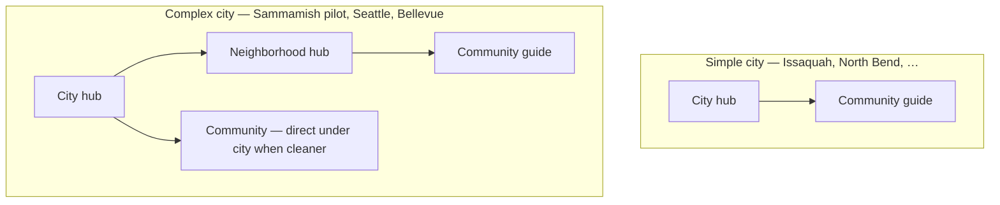

# Fence Frames — Site Architecture

> **You read this note.** Agent/repo mirror: `FenceBook/docs/fence-frames-site-architecture.md` — keep in sync when IA changes.  
> **Strategy:** [[Fence Frames — Business Plan|Business Plan]] · **Platform:** `FenceBook/docs/platform-stack.md`

> **v1 locked 2026-07-06.** June `/areas/` + neighborhood-layer sections **below are retired** unless marked current.  
> **Canonical:** [[Fence Frames — Site Architecture v1 addendum|addendum mirror]] · `FenceBook/docs/fence-frames-site-architecture.md`

**Status:** v1 merged **2026-07-06** — site-arch closeout complete.  
**Pilot:** **North Bend cluster** (D9).  
**Nav:** **Communities** → `/wa/king-county` (D6).  
**Alias:** `/community/{slug}` → 301 canonical (W2).

---

## Geo URLs (current — D1)

| Layer | Example |
|-------|---------|
| County | `/wa/king-county` |
| City | `/wa/king-county/north-bend` |
| Community | `/wa/king-county/north-bend/si-view` |
| Configure | `/configure?community_preset=si-view` *(flat — not under /wa/)* |

**Mega pseudo-city:** `/wa/king-county/klahanie/klahanie` · `/wa/king-county/snoqualmie-ridge/snoqualmie-ridge`  
**Under municipal city:** `/wa/king-county/sammamish/sahalee` (not `/sammamish/klahanie`)

**Retired:** `/areas/king-county-wa/…` · neighborhood URL tier · `king-county-wa` slug.

---

## ~~DEPRECATED — June 2026 draft below~~

> The following sections are **struck** for v1. Kept for archaeology until Obsidian cleanup pass. **Do not build from this block.**

---

## ~~Geo taxonomy (lock these words)~~

| Layer | Name | URL segment | Example |
|-------|------|-------------|---------|
| 1 | **County** | `/areas/{county-slug}` | `king-county-wa` |
| 2 | **City** | `…/{city-slug}` | `sammamish` |
| 3 | **Neighborhood** | `…/{neighborhood-slug}` | *complex cities only* → `klahanie` |
| 4 | **Community** | `…/{community-slug}` | `klahanie` (leaf guide) |

**Do not call the leaf layer "HOA."** Use **Community** publicly. Airtable may keep the **HOAs** table internally; Wix CMS publishes **Communities**.

**Multi-county marketing label:** Use **metro / service area** (e.g. "Greater Seattle") for optional hub pages that *link* to counties — not as a replacement for county slugs.

---

## City tiers

Cities differ in depth. Set `cityTier` on every City record.



| Tier | `cityTier` | URL depth | King County examples |
|------|------------|-----------|-------------------|
| **Simple** | `simple` | County → City → Community | Issaquah, North Bend, Snoqualmie, Mercer Island, Kirkland, Redmond, Renton, Maple Valley, Covington, Kent, … |
| **Complex** | `complex` | County → City → Neighborhood → Community *(or shortcut)* | **Sammamish (pilot)**, Seattle, Bellevue |

### Shortcut rule

When **one neighborhood = one community** (common for CFAs), the **neighborhood page is the community guide** — one URL, `isAlsoCommunity: true`. Do not add a fourth URL segment unless multiple communities exist inside one neighborhood.

### Direct attach rule

In complex cities, a community may attach **directly under the city** when a neighborhood bucket does not help (e.g. `/bellevue/somerset`).

---

## Launch geography

| Wave | Geography | Ops zone | Notes |
|------|-----------|----------|-------|
| **1** | **King County** | Green | Full IA pilot; city + community pages |
| **2** | Snohomish + Pierce counties | Yellow | Reuse templates; county shells + top cities |
| **3** | Rest of WA | Red / waitlist | Demand-driven |
| **4** | **Oregon** | TBD | Same county model; new municipal research |

**Expansion speed:** King → adjacent WA counties (fast) → Oregon (state 2, slower).

---

## URL map

### County

```
/areas/king-county-wa
```

### Simple city (Issaquah)

```
/areas/king-county-wa/issaquah
/areas/king-county-wa/issaquah/issaquah-highlands
/areas/king-county-wa/issaquah/talus
```

### Complex city — Sammamish (pilot)

```
/areas/king-county-wa/sammamish
/areas/king-county-wa/sammamish/klahanie
/areas/king-county-wa/sammamish/pine-lake
```

Optional later (when 2+ live neighborhoods in a bucket):

```
/areas/king-county-wa/sammamish/plateau-east
```

### Complex city — Seattle

```
/areas/king-county-wa/seattle
/areas/king-county-wa/seattle/laurelhurst
/areas/king-county-wa/seattle/magnolia
```

Seattle **neighborhood buckets** are hub **sections** at launch; optional bucket subpages later.

### Complex city — Bellevue

```
/areas/king-county-wa/bellevue
/areas/king-county-wa/bellevue/somerset
```

Clyde Hill, Medina, Yarrow Point → **own city pages** (separate municipalities), not Bellevue neighborhoods.

---

## Community types (`communityType`)

| Value | Examples | Badge copy |
|-------|----------|------------|
| `hoa` | Si View, Somerset | HOA |
| `roa` | Snoqualmie Ridge ROA | ROA |
| `cfa` | Laurelhurst, View Ridge | Community association |
| `cd` / `pud` | Plats with design standards | Development |
| `named_area` | Talus, Highlands — no formal HOA | Guide |
| `municipal_overlay` | District-level rules | City district |

Page title pattern: **`{Name} — fence standards guide`**

---

## Page templates

### 1. County hub

- H1: King County fence standards & local guides
- County code / climate summary (your copy — not verbatim municipal paste)
- Featured cities repeater (Tier A live, Tier B stub)
- Configure CTA + ZIP gate
- Partners in county
- FAQ + disclaimer

### 2. City hub (all cities)

- Municipal standards summary
- Configure CTA
- Partners in city
- **Simple:** community cards grouped by type / area — **Fence standards by community**
- **Complex:** neighborhood bucket sections → community cards inside each
- FAQ + disclaimer

### 3. Neighborhood hub (complex only)

- Geographic context; inherit city rules
- Communities in this neighborhood (coming soon / live)
- If `isAlsoCommunity` → full fact matrix on this page

### 4. Community guide (leaf — SEO target)

- Fact matrix + approved builds (your IP — not HOA PDF republication)
- Workflow (ARC / ROA / CFA — type-specific)
- Publication tier + disclaimer ([[Fence Frames — Business Plan#HOA directory go-to-market|Business Plan tiers]])
- CTA: **Design for this community** → configurator with preset

---

## Publication & launch states (`seoStatus`)

| State | Indexed? | UX |
|-------|----------|-----|
| `coming_soon` | No (hub card only) | Listed on parent hub; not linked |
| `stub` | `noindex, follow` | Thin placeholder if URL reserved early |
| `live` | `index, follow` | Full template |

**Launch while updating:** Parent hubs **live**; seed all children in CMS as `coming_soon`; flip per row when content ready.

---

## King County — city rollout tiers

### Tier A — launch (live or priority)

Bellevue, Sammamish, Issaquah, Mercer Island, Redmond, North Bend, Snoqualmie, Seattle, Kirkland

### Tier B — finish King County

Renton, Maple Valley, Covington, Kent, Auburn, Federal Way, Burien, Shoreline, Kenmore, Bothell, Woodinville, Newcastle, SeaTac, Tukwila, Des Moines, Enumclaw, Black Diamond

### Tier C — fill later

Smaller places (Fall City, Carnation, Duvall, Preston, …)

---

## Sammamish — pilot complex city

**Why pilot here:** Klahanie is the gold-standard **named design** reference (A–D); Sammamish is smaller than Seattle but still needs neighborhood grouping; validates full complex stack before Seattle scale.

### Seed neighborhood buckets (hub sections)

| Bucket | Seed neighborhoods (coming soon → live) |
|--------|----------------------------------------|
| **Klahanie & east plateau** | Klahanie, Pine Lake, Trossachs |
| **Central Sammamish** | Sahalee, Beaver Lake, Eklund Park |
| **North plateau** | Eagle Ridge, Inglewood, North Sammamish |
| **South / 228th corridor** | Sammamish Commons area, ADU-dense streets TBD |

### Pilot communities (first `live` targets)

| Community | Type | Notes |
|-----------|------|-------|
| **Klahanie** | `hoa` / large plat | Reference structure A–D; primary pilot content |
| *(add from* `hoa-target-list.csv`*)* | | Tag `city` + `neighborhood` + `communityType` |

### Success criteria for pilot

- [ ] City hub live with all buckets + coming-soon cards
- [ ] At least **1 neighborhood hub** live
- [ ] At least **1 community guide** live with approved builds + configure deep link
- [ ] Wix dynamic routes + `seoStatus` gating verified
- [ ] Sync from Configurator HOAs → Wix Communities tested
- [ ] Clone pattern documented for Seattle

---

## Seattle — complex city (after Sammamish pilot)

- **City hub live** at launch with neighborhood buckets as sections
- All neighborhoods seeded `coming_soon` on hub (no broken links)
- Flat neighborhood URLs: `/seattle/{neighborhood-slug}` when live
- Optional bucket subpages when 2+ neighborhoods in bucket are live

### Seattle neighborhood buckets (seed list)

| Bucket | Examples |
|--------|----------|
| Northeast Seattle | Laurelhurst, View Ridge, Ravenna, Wedgwood, Roosevelt |
| Northwest Seattle | Ballard, Fremont, Green Lake, Phinney, Wallingford |
| Queen Anne & Magnolia | Queen Anne, Magnolia, Interbay |
| Capitol Hill & Central | Capitol Hill, Central District, First Hill, Madison Valley |
| Lake Washington edge | Madison Park, Montlake, Windermere, Leschi, Mount Baker |
| West Seattle | Alki, Admiral, Fauntleroy, Westwood, Arbor Heights |
| South & Southeast | Beacon Hill, Columbia City, Rainier Beach, Georgetown |

Prioritize **live** order by CFA/HOA density (Laurelhurst, View Ridge, Magnolia, Madison Park, …).

---

## Bellevue — complex city

- Mostly **city → community** direct links (e.g. Somerset)
- Use neighborhood layer when multiple communities share an area (e.g. Crossroads)
- Somerset = high-interest; division map + CRC — treat as **community**, not generic HOA

---

## Full sitemap (product surfaces)

| Path | Type | Audience |
|------|------|----------|
| `/` | Static | Landing |
| `/how-it-works` | Static | Homeowners |
| `/design` | Dynamic index | Build gallery |
| `/design/{slug}` | Dynamic | Build detail |
| `/design/configure` | App embed | Configurator |
| `/areas` | Static | Counties hub |
| `/areas/king-county-wa` | Dynamic | County |
| `/areas/king-county-wa/{city}` | Dynamic | City |
| `/areas/.../{neighborhood}` | Dynamic | Neighborhood (complex) |
| `/areas/.../{community}` | Dynamic | Community guide |
| `/contractors` | Static + CMS | Public partner directory |
| `/contractors/join` | Static | Partner application |
| `/contractors/{slug}` | Dynamic | Partner profile |
| `/portal/*` | Gated | Contractor lead inbox |

**Homeowner accounts** (saved designs): phase 2 — Wix Members + Supabase `client_id`.

---

## Wix CMS collections

| Collection | Key fields |
|------------|------------|
| **Counties** | `slug`, `name`, `state`, `zone` (green/yellow/red), `meta*`, `intro`, `codeSummary`, `featuredCitySlugs[]`, `launchWave`, `isPublished` |
| **Cities** | `county` (ref), `slug`, `cityTier` (simple/complex), `tier` (A/B/C), `seoStatus`, `meta*`, `municipalCodeSummary`, `zipPrefixes[]` |
| **NeighborhoodBuckets** | `parentCity` (ref), `slug`, `name`, `displayOrder`, `intro`, `bucketPageStatus` |
| **Neighborhoods** | `parentCity`, `bucket` (ref), `slug`, `seoStatus`, `isAlsoCommunity`, `meta*` |
| **Communities** | `parentCity`, `parentNeighborhood` (optional), `communityType`, `slug`, `seoStatus`, `publicationTier`, `factMatrix`, `approvedBuildSlugs[]`, `disclaimer`, `configuratorPresetId` |
| **FenceDesigns** | Sync from Supabase — gallery + detail |
| **PartnersPublic** | Sync from Ops — public directory subset |

### Airtable ↔ Wix sync

| Source | Target | Notes |
|--------|--------|-------|
| Configurator **HOAs** | **Communities** | Add `communityType`, `neighborhood`, `slug`, `seoStatus` |
| Ops **Partners** | **PartnersPublic** | Filter `isListed` |
| Ops **Coverage Zones** | Counties / Cities `zone` | County-level defaults |
| Supabase builds | **FenceDesigns** | Scheduled Velo sync |

---

## Configurator integration

```
Community / city CTA
  → /design/configure?community={id}&city={slug}
  → embed (?embed=1)
  → Velo → Supabase (catalog + presets)
  → quote request → Supabase quote
  → Velo → Ops Leads (bridge IDs)
  → ZIP gate: green / yellow / red
```

- **One embed URL** on Fence Frames + TLB (`?channel=ff` vs `?channel=tlb`)
- Deep links from every live community and city page
- Red zones: design + waitlist only — no contractor promise

---

## Contractors

| Surface | Path | Data |
|---------|------|------|
| Public directory | `/contractors` | Ops Partners (listed) |
| Join | `/contractors/join` | Form → Ops Partners (manual approve) |
| Partner profile | `/contractors/{slug}` | Ops Partners (public fields) |
| Member area | `/portal` | Wix Members role `contractor` → Leads inbox |

---

## Schema.org (JSON-LD)

| Page | Types |
|------|-------|
| Home | `Organization`, `WebSite` |
| County / City / Neighborhood | `WebPage`, `BreadcrumbList`, optional `FAQPage` |
| Community | `WebPage`, `BreadcrumbList` — not `LocalBusiness` |
| Design detail | `Service` or `Product` |
| Contractors index | `ItemList` of `LocalBusiness` |
| Partner profile | `LocalBusiness` |

Reuse Velo patterns in `FenceBook/Website.md`; provider = **Fence Frames LLC**.

---

## TLB site reuse (twolewbuilders.com)

| Reuse | Do not copy |
|-------|-------------|
| Section layouts, repeaters, form patterns | Deck / siding / roof pages |
| Velo SEO code (`Website.md`) | TLB LocalBusiness schema |
| Dynamic page pattern | TLB portfolio as Fence Frames content |
| Git sync workflow | "Future Use" placeholders |

**Workflow:** Duplicate Wix site → Fence Frames brand → strip non-fence → add CMS collections above → **separate** git sync from TLB production.

---

## Legal (communities)

From business plan — **your IP only** on public pages:

| Include | Avoid |
|---------|-------|
| Your SVG blueprints, fact matrix, workflow | Verbatim CC&R / guideline text |
| Paraphrased requirements + source pointer | HOA logos without permission |
| Tier 1 disclaimer minimum | "Official" partnership implication |

**LLC required** before public community directory goes live.

---

## Implementation order

| Step | Deliverable |
|------|-------------|
| 1 | Wix CMS collections + field list in Editor |
| 2 | County + Tier A city templates |
| 3 | **Sammamish complex pilot** (buckets, neighborhoods, 1 live community) |
| 4 | Configurator embed + quote → Lead bridge |
| 5 | Simple cities (North Bend / Si View, Snoqualmie / Ridge) |
| 6 | Seattle hub (coming-soon neighborhoods) |
| 7 | Contractors public + `/portal` |
| 8 | Snohomish / Pierce county shells |

---

## Open items

- [ ] Finalize Sammamish neighborhood seed list from `FenceBook/docs/HOA/hoa-target-list.csv`
- [ ] ZIP prefixes on Community rows vs city-only until live
- [ ] Broadmoor / Blue Ridge: neighborhood vs dedicated bucket on Seattle hub
- [ ] Confirm Wix plan for nested dynamic routes / `wix-router`
- [ ] Purchase `fenceframes.com` + `.app`; Fence Frames LLC before public directory

---

## Related

- [[Fence Frames]]
- [[Fence Frames — Business Plan]]
- [[Fence Frames — Plan Fulfillment]]
- `FenceBook/docs/platform-stack.md`
- `FenceBook/docs/HOA/README.md`
- `FenceBook/docs/fence-frames-business-plan.md`

---

*Last updated: 2026-06-18 — King County launch IA, Sammamish complex pilot, Community leaf layer.*
